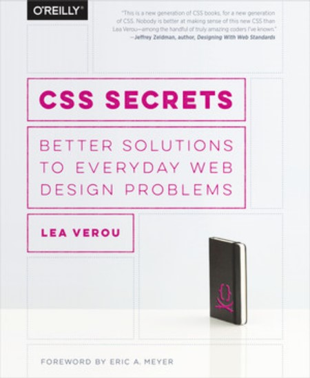

# Recurso 04 - Libro 📕 (2015)

Apuntes y prácticas de mi estudio del lenguaje CSS3, utilizando como guía el libro: **CSS Secrets**.

## ⏲ Información sobre el tiempo dedicado

- **Fecha de inicio**: 2026-02-..
- **Fecha de término**: Sin comenzar
- **Porcentaje de avance**: 00%
- **Tracker**:
```
2026 Mes
Lu Ma Mi
00 00 00
__ __ __
```

## 📕 Información del libro



- **Título**: CSS Secrets
- **Autor**: Lea Verou
- **Idioma**: Inglés
- **Año publicación**: 2015
- **Número de páginas**: 390
- **Editorial**: O'Reilly
- **Formato**: PDF

## 🖥 Información sobre mi setup

- **Editor**: VS Code v1.108
- **Navegador**: Firefox v147.0.2
- **Sistema Operativo**: Windows v11 home
- **PDF Reader**: Foxit PDF Reader v2025.3.0

***

## Índice del libro

- Capítulo 01: Introducción
  - 00.01: Estándares Web
  - 00.02: Tips para codificar CSS

- Capítulo 02: Fondos y Bordes
  - 01: Bordes translucidos
  - 02: Bordes multiples
  - 03: Posicionamiento flexible del fondo
  - 04: Redondeado interior
  - 05: Fondos rayados
  - 06: Patrones complejos de fondo
  - 07: Fondos (Pseudo)aleatorios
  - 08: Bordes de imagen continuos

- Capítulo 03: Formas
  - 09: Elipses flexibles
  - 10: Paralelogramos
  - 11: Imágenes en diamante
  - 12: Cortando las esquinas
  - 13: Pestañas trapezoidales
  - 14: Gráficas de pay simples

- Capítulo 04: Efectos Visuales
  - 15: Sombras de un tamaño
  - 16: Sombras por debajo irregulares
  - 17: Tinte de color
  - 18: Efecto de vidrio congelado
  - 19: Efecto de esquina doblada
  
- Capítulo 05: Tipografía
  - 20: Separación
  - 21: Intersectando los saltos de línea
  - 22: Líneas de texto en rayas de zebra
  - 23: Ajustando el ancho de la pestaña
  - 24: Ligaduras
  - 25: Ampersons chulos
  - 26: Subrayados personalizados
  - 27: Efectos realistas de texto
  - 28: Texto circular
  
- Capítulo 06: Experiencia de Usuarios UX
  - 29: Seleccionando el cursor correcto
  - 30: Extendiendo el área clickable
  - 31: _Checkboxes_ personalizados
  - 32: Reducir el énfasis atenuado
  - 33: Desenfocar el énfasis
  - 34: Pistas para _scrolear_
  - 35: Comparación interactiva de imagen

- Capítulo 07: Estructura y Disposición
  - 36:
