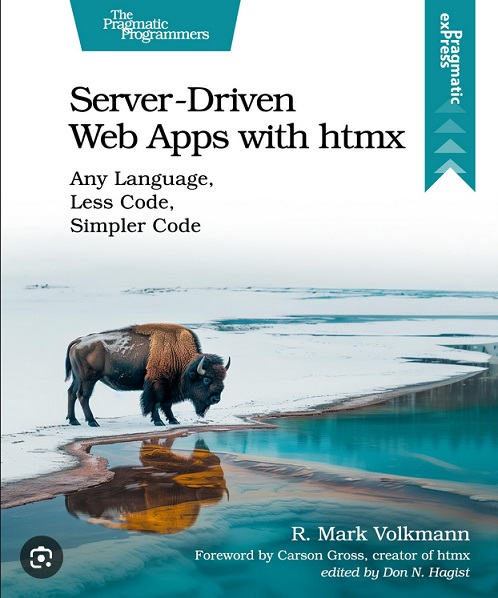

# Recurso 06 - Libro 📕 (2024)

Apuntes y prácticas de mi estudio del lenguaje HTMLX, utilizando como guía el libro: **Server-Driven Web Apps with HTMX**.

## ⏲ Información sobre el tiempo dedicado

- **Fecha de inicio**: 2026-04-01
- **Fecha de término**: Estudiando
- **Porcentaje de avance**: 12% - p.23 de 182 - `[#######_______________________]` x3
- **Días efectivos**: 01
- **Calificación**:

### 🎯 Tracker

```md
# Tracker

## 2026 Abril
Mi Ju Vi Sa Do Lu Ma Mi Ju Vi Sa Do Lu Ma Mi Ju Vi Sa Do Lu Ma Mi Ju Vi Sa Do Lu Ma Mi Ju
01 02 03 04 05 06 07 08 09 10 11 12 13 14 15 16 17 18 19 20 21 22 23 24 25 26 27 28 29 30
><
```

## 📕 Información del libro



- **Título**: Server-Driven Web Apps with HTMX
- **Edición**: 4th
- **Autor**: R. Mark Volkmann
- **Idioma**: Inglés
- **Año publicación**: 2024
- **Número de páginas**: 182
- **Editorial**: The Pragmatic Programmers
- **Formato**: PDF

## 🖥 Información sobre mi setup

- **Editor**: VS Code v1.113.0
- **Navegador**: Firefox v149.0

***

## Índice del libro

- [Capítulo 0: Introducción](00-Introduccion.md)
- [Capítulo 1: Saltando Dentro](01-Salta-dentro.md)
- Capítulo 2: Explorando las Opciones del Servidor
- Capítulo 3: Desarrollando los _Endpoints_
- Capítulo 4: Recetas para Escenarios Comunes
- Capítulo 5: Implementando Interactividad
- Capítulo 6: Utilizando el API JS de htmx
- Capítulo 7: Añadiendo Seguridad
- Capítulo 8: Más allá del _Request/Response_
