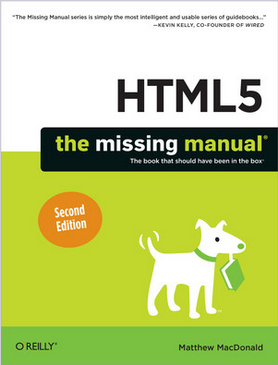

# Revisión 01 (2026)

Apuntes y prácticas de mi estudio del lenguaje HTML5, utilizando como guía el libro: **HTML5 the missing manual** (2nd Edition).

## ⏲ Información sobre el tiempo dedicado

- **Fecha de inicio**: 2026-02-01
- **Fecha de término**: continuo estudiando
- **Porcentaje de avance**: 00%

## 📕 Información del libro

- **Título**: HTML5: The Missing Manual
- **Edición**: 2nd Edition
- **Autor**: Matthew MacDonald
- **Idioma**: Inglés
- **Año publicación**: 2013
- **Número de páginas**: 518
- **Editorial**: O'Reilly Media, Inc.
- **Nivel**: Intermedio a Avanzado
- **Formato**: PDF

## 🖥 Información sobre mi setup

- **Editor**: VS Code v1.108
- **Navegador**: Firefox v147.0.2

***

## Índice del libro

- [Introducción](00-01.Introduccion.md)
- [_Markup_ Moderno](01-00.Markup_Moderno.md)
  - [Introducción a HTML5](01-01.Introduccion_HTML5.md)
  - Estructurando Páginas con Elementos Semánticos
  - Escribiendo Más _Markup_ Magnifico
  - Construyendo Mejores Formularios Web
- Video, gráficos y _Glitz_
  - Audio y video
  - Fuentes bonitas y efectos con CSS3
  - Diseño responsivo con CSS3
  - Dibujo básico con _Canvas_
  - _Canvas_ avanzado: Interactividad y animación
- Construyendo aplicaciones Web
  - Almacenado tu información
  - Ejecución _offline_
  - Comunicándose con el servidor _web_
  - Geolocalización, _web workers_ y administración del historial
- Apendices
  - CSS esencial
  - JavaScript: El cerebro de tu página
