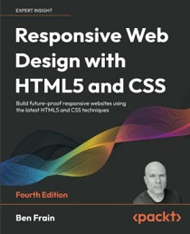

# Revisión 02 (2026)

Apuntes y prácticas de mi estudio del lenguaje HTML5, utilizando como guía el libro: **Responsive Web Design with HTML5 and CSS** (4nd Edition).

## ⏲ Información sobre el tiempo dedicado

- **Fecha de inicio**: 2026-02-01
- **Fecha de término**: continuo estudiando
- **Porcentaje de avance**: 00%

## 📕 Información del libro

- **Título**: Responsive Web Design with HTML5 and CSS
- **Edición**: 4nd Edition
- **Autor**: Ben Frain
- **Idioma**: Inglés
- **Año publicación**: 2022
- **Número de páginas**: 499
- **Editorial**: packt
- **Formato**: PDF

## 🖥 Información sobre mi setup

- **Editor**: VS Code v1.108
- **Navegador**: Firefox v147.0.2

***

## Índice del libro

- Sección I: Los fundamentos del diseño web responsivo
  - Capítulo 01: Lo esencial del diseño web responsivo
  - Capítulo 02: Escribir HTML _markup_
  - Capítulo 03: _Media Queries_ y _Container Queries_
  - Capítulo 04: _Layout_ fluido y _Flexbox_
  - Capítulo 05: _Layout_ con CSS _Grid_
- Sección II: Habilidades Fundamentales y Desarrollo Web _Front-End_ Efectivo
  - Capítulo 06: Selectores CSS, Tipografía y Más
  - Capítulo 07: Color CSS
  - Capítulo 08: Aspecto Increíble con CSS
  - Capítulo 09: Imágenes Responsivas
  - Capítulo 10: SVG
  - Capítulo 11: Transiciones, Transformaciones y Animaciones
  - Capítulo 12: Propiedades Personalizadas y Funciones CSS
  - Capítulo 13: Forms
- Sección III: Últimas Características de la Plataforma y Consejo de Despedida
  - Capítulo 14: Características CSS _Cutting-Edge_
  - Capítulo 15: Técnicas Extras y Consejo de Partida
