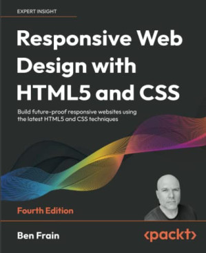

# Revisión 02 (2026)

Apuntes y prácticas de mi estudio del lenguaje HTML5, utilizando como guía el libro: **Responsive Web Design with HTML5 and CSS** (4nd Edition).

## ⏲ Información sobre el tiempo dedicado

- **Fecha de inicio**: 2026-02-01
- **Fecha de término**: continuo estudiando
- **Porcentaje de avance**: 00%

## 📕 Información del libro

- **Título**: Responsive Web Design with HTML5 and CSS
- **Edición**: 4nd Edition
- **Autor**: Ben Frain
- **Idioma**: Inglés
- **Año publicación**: 2022
- **Número de páginas**: 499
- **Editorial**: packt
- **Formato**: PDF

## 🖥 Información sobre mi setup

- **Editor**: VS Code v1.108
- **Navegador**: Firefox v147.0.2

***

## Índice del libro

  1. 
